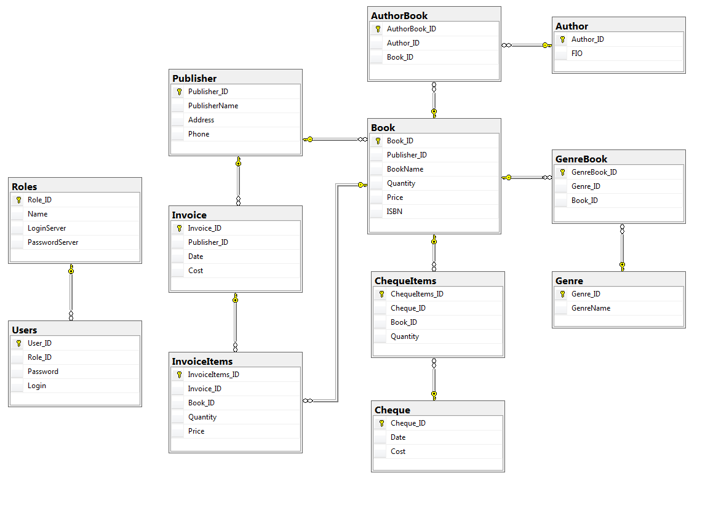
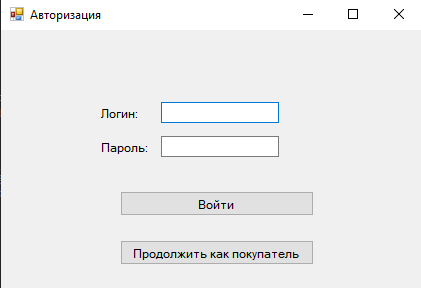
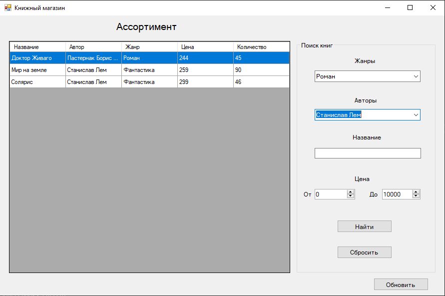
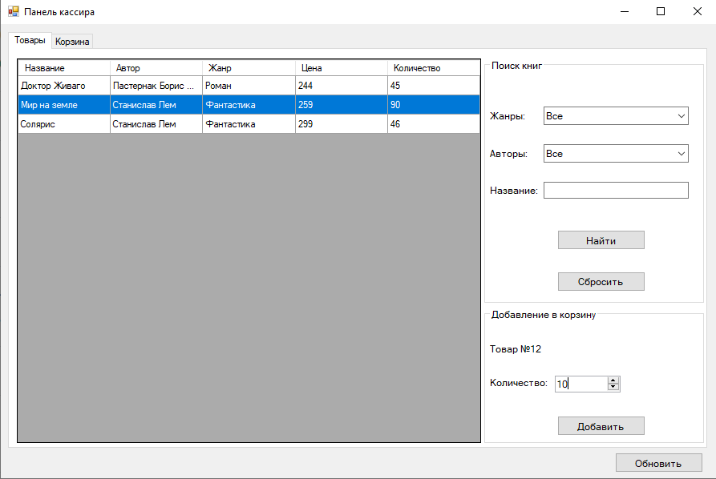
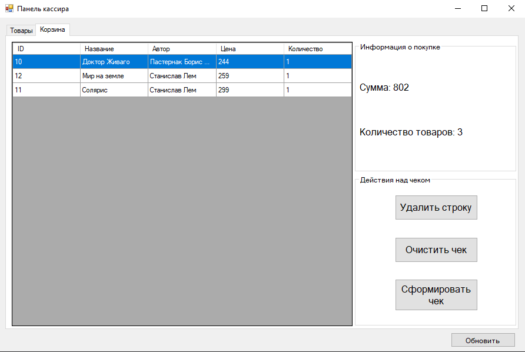
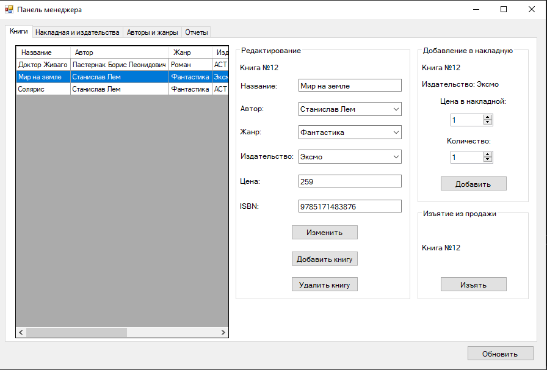
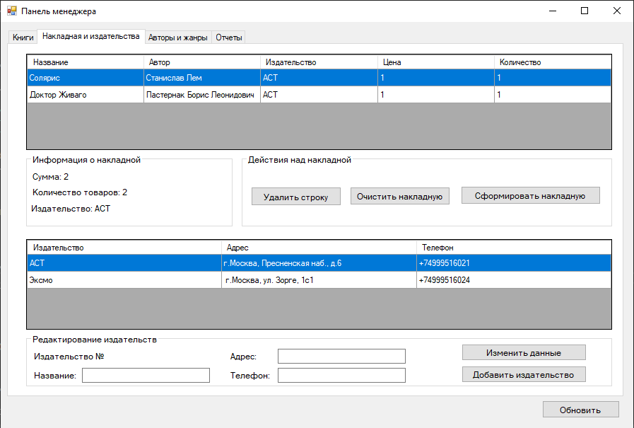
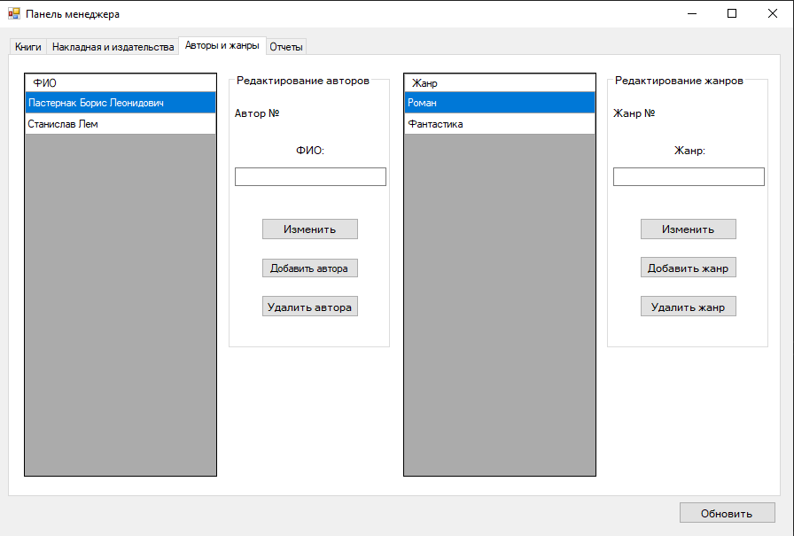
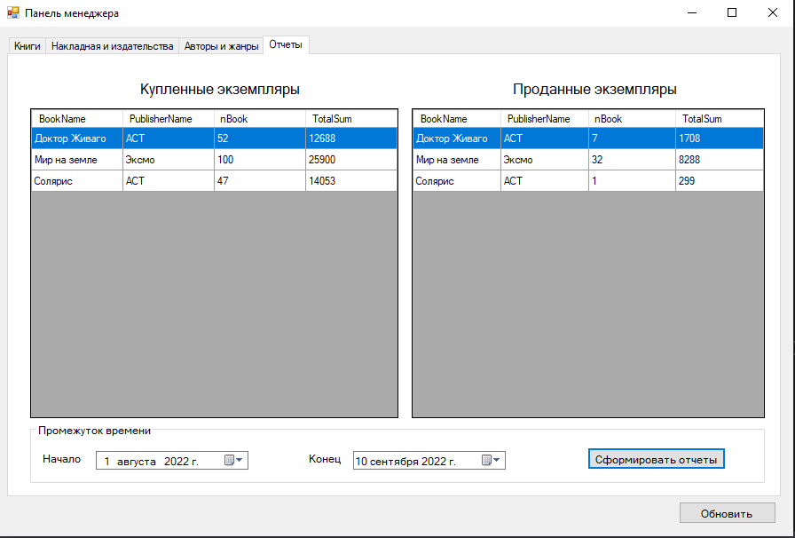

# Информационная система "Книжный магазин"

Курсовая работа по дисциплине "Администрирование и проектирование хранилищ данных". 

Проект представляет собой разработку реляционной базы данных и клиентского приложения для информационной системы "Книжный магазин".

Система предназначена для автоматизации учета закупленных у издательств и проданных в розницу книг. Она обеспечивает хранение информации о книгах, авторах, издательствах, накладных и чеках.

---
## 👥 Пользователи системы

Система имеет три роли пользователей:

* **Менеджер (Manager):** Имеет полный доступ к функционалу системы.
* **Кассир (Cashier):** Может формировать чеки и просматривать ассортимент.
* **Покупатель (Shopper/Reader):** Может просматривать и искать книги в ассортименте.

---
## ⚙️ Основные функции

* **Формирование чека:** Создание чека при продаже книг (доступно Кассиру).
* **Формирование накладной:** Создание накладной при закупке книг у издательства (доступно Менеджеру).
* **Создание отчетов:** Получение отчетов о проданных и купленных книгах за указанный период (доступно Менеджеру).
* **Поиск и фильтрация:** Просмотр и поиск книг с возможностью фильтрации по жанрам, ценам, названию и автору (доступно всем ролям).
* **Управление каталогами:** Менеджер может добавлять, изменять и удалять информацию о книгах, авторах, жанрах и издательствах.

---
## 🛠️ Технологии

* **Язык программирования:** C#.
* **Графический интерфейс:** WinForms.
* **Среда разработки:** Visual Studio 2019.
* **СУБД:** Microsoft SQL Server 2017.
* **Платформа:** .NET Framework 4.7.2.

---
## 🗄️ Схема Базы Данных

Реляционная модель базы данных включает 12 таблиц для хранения всей необходимой информации и обеспечения целостности данных.

---
## 🖼️ Скриншоты приложения

### Форма авторизации

### Интерфейс покупателя

### Интерфейс кассира
* **Вкладка с выбором книг для добавления в корзину**

* **Вкладка с корзиной**

### Интерфейс менеджера
* **Управление ассортиментом**

* **Работа с накладными**

* **Удаление, редактирование и добавление данных о жанрах и авторах**

* **Просмотр отчетов**

